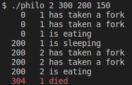

# Philosophers
### 💡 I never thought philosophy would be so deadly 💡

---

## 🗂️ Index

* [PDF version](#pdf-version)
* [Project description](#project-description)
* [Project status](#project-status)
* [Global rules](#global-rules)
* [Download](#project-access)
* [Open and run the project](#open-and-run-the-project)
* [Author](#author)

---

## ⚠️ PDF version
10

---

## 📃 Project description
The objective of this project, is we learn the basics of threading a process.
We see how to create threads and we discover mutexes.

---

## 🚦 Project status
> 🟢 Project finished 🟢

---

## 🌐 Global rules
- Your(s) program(s) should take the following arguments:
number_of_philosophers time_to_die time_to_eat time_to_sleep [number_of_times_each_philosopher_must_eat]
    - **number_of_philosophers:** The number of philosophers and also the number of forks.
    - **time_to_die (in milliseconds):** If a philosopher didn’t start eating time_to_die milliseconds since the beginning of their last meal or the beginning of the simulation, they die.
    - **time_to_eat (in milliseconds):** The time it takes for a philosopher to eat. During that time, they will need to hold two forks.
    - **time_to_sleep (in milliseconds):** The time a philosopher will spend sleeping.
    - **number_of_times_each_philosopher_must_eat (*optional argument*):** If all philosophers have eaten at least number_of_times_each_philosopher_must_eat times, the simulation stops. If not specified, the simulation stops when a philosopher dies.
- Each philosopher has a number ranging from 1 to number_of_philosophers.
- Philosopher number 1 sits next to philosopher number number_of_philosophers. Any other philosopher number N sits between philosopher number N - 1 and philosopher number N + 1.
- Any state change of a philosopher must be formatted as follows: (*where X is the philo number*)
    - timestamp_in_ms X has taken a fork
    - timestamp_in_ms X is eating
    - timestamp_in_ms X is sleeping
    - timestamp_in_ms X is thinking
    - timestamp_in_ms X died

    Example:

    

    *Replace timestamp_in_ms with the current timestamp in milliseconds and X with the philosopher number.*
- A displayed state message should not be mixed up with another message.
- A message announcing a philosopher died should be displayed no more than 10 ms after the actual death of the philosopher.
- Again, philosophers should avoid dying!

### ⭐ Mandatory's part ⭐
- Each philosopher should be a thread.
- There is one fork between each pair of philosophers. Therefore, if there are several
philosophers, each philosopher has a fork on their left side and a fork on their right
side. If there is only one philosopher, there should be only one fork on the table.
- To prevent philosophers from duplicating forks, you should protect the forks state
with a mutex for each of them.

### 🌟 Bonus' part 🌟
- All the forks are put in the middle of the table.
- They have no states in memory but the number of available forks is represented by a semaphore.
- Each philosopher should be a process. But the main process should not be a
philosopher.

---

## 📁 Download
```bash
git clone https://github.com/edmarpaulino/philosophers.git
```

---

## 🛠️ Open and run the project

### 🧰 Prerequisites 🧰
- cc
- make

### ⚙️ make flags ⚙️
- make `all` to build the project
- make `clean` to delete object files
- make `fclean` to delete object files and the executable file
- make `re` to rebuild the project (`fclean` + `all`)

### ⭐ Mandatory's part ⭐
```bash
cd ./philosophers/philo
```

```bash
make
```
1. Number of philosophers
2. Time to die
3. Time to eat
4. Time to sleep
5. Number of times each philosopher must eat (*Optional*)
```bash
./philo 1 2 3 4 [5]
```
Example:
```bash
./philo 2 800 200 200
./philo 2 800 200 200 4
```
### 🌟 Bonus' part 🌟
```bash
cd ./philosophers/philo_bonus
```
```bash
make
```
1. Number of philosophers
2. Time to die
3. Time to eat
4. Time to sleep
5. Number of times each philosopher must eat (*Optional*)
```bash
./philo_bonus 1 2 3 4 [5]
```
Example:
```bash
./philo 2 800 200 200
./philo 2 800 200 200 4
```
---

## 👨🏾‍💻 Author
[Edmar Paulino](https://github.com/edmarpaulino)

---
